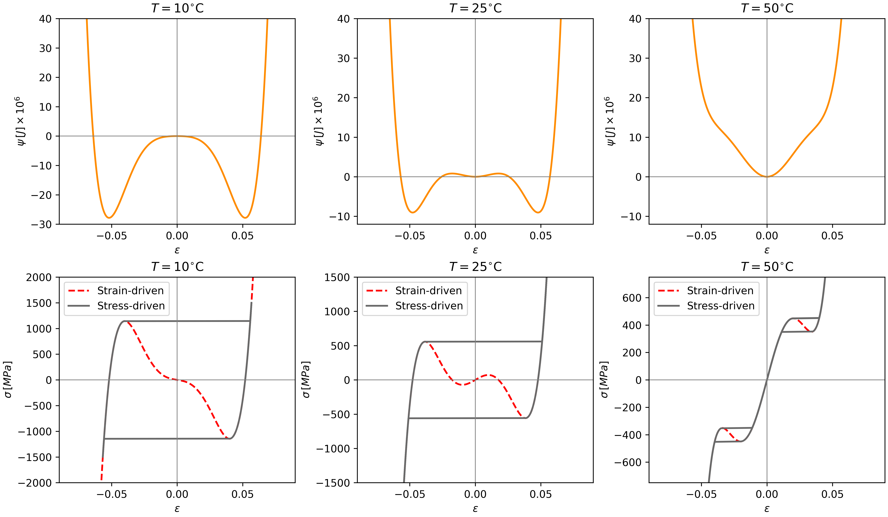

# Falk's One-Dimensional Shape Memory Alloy (SMA) Model

This repository contains the implementation of the one-dimensional shape memory alloy (SMA) phenomenological model proposed by Falk \[1, 2\].

The model is based on a Landau-type free energy function that
describes the phase transformation behavior of SMA materials.

The free energy is defined as a function of strain and temperature such that

$$
\rho\psi(\varepsilon, T) = \frac{a}{2}\left(T - T_m\right)\varepsilon^2 -\frac{b}{4}\varepsilon^4 + \frac{b^2}{24a\left(T_a - T_m\right)}\varepsilon^6
$$

1.  **High temperatures ($T > T_a$):**\
    The energy has a single minimum at zero strain associated with the
    stable austenite (A) phase.

2.  **Intermediate temperatures ($T_m < T < T_a$):**\
    The energy exhibits three distinct minima:

    -   One at zero strain corresponding to stable austenite (A).
    -   Two symmetric minima at non-zero strains representing detwinned
        martensite induced by compression ($M^−$) and tension ($M^+$).

3.  **Low temperatures ($T < T_m$):**\
    The energy has two symmetric minima at non-zero strains associated
    with stable martensite phases ($M^-$ and $M^+$), while the austenite phase
    becomes unstable.

The parameter $\alpha$ from reference \[1\] is modified as done in Savi & Braga \[2\]:

$$\alpha \propto \frac{b^2}{a (T_a - T_m)} $$

This modification defines the temperature $T_a$, above which the austenite phase is stable and the free energy has only one minimum at zero strain.

## Output Example

## References

\[1\] Falk, F. (1980). [Model free energy, mechanics and thermodynamics
of shape memory alloys](https://doi.org/10.1016/0001-6160(80)90030-9). Acta Metallurgica, 28, 1773--1780.

\[2\] Falk, F. (1983). [One-dimensional model of shape memory alloys](https://rcin.org.pl/ippt/publication/161795). Archives of Mechanics, 35(1), 63--84.

\[3\] Savi, M.A. & Braga, A.M.B. (1993). [Chaotic vibrations of an oscillator with shape memory](https://www.researchgate.net/publication/233783381_Chaotic_Vibrations_of_an_Oscillator_with_Shape_Memory). Journal of the Brazilian Society of Mechanical Sciences, 15(1), 1--20.
